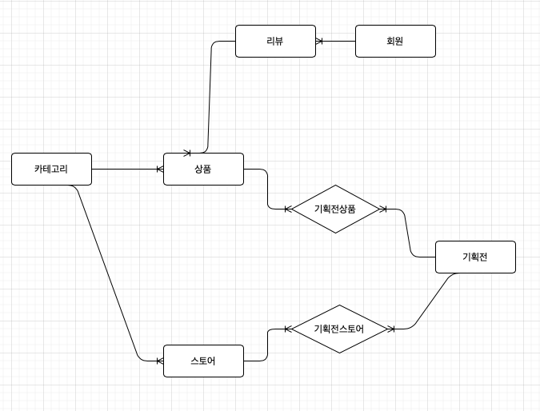

# Food-Service
- ES 스터디 후 프로젝트 구조 설계 

## 요구사항

`카테고리`
- 카테고리는 자식을 가질 수 없다. (flat 한 구조)
    - 해시태그와 같은 개념으로 사용

`상품`
- 상품은 여러 카테고리에 분류 될 수 있다.
- 상품은 여러 리뷰를 가질 수 있다

`스토어`
- 스토어는 여러 카테고리를 가질 수 있다
- 스토어는 여러 상품을 판매할 수 있다

`기획전`
- 기획전은 여러 스토어를 설정할 수 있다
- 기획전은 여러 상품이 속할 수 있다
- 기획전은 정해진 기간 내에만 전시 되어야 한다

`회원`
- 회원은 관리자와 일반 사용자, 판매자로 구분된다
- 회원은 여러 리뷰를 작성할 수 있다
  
`리뷰`
- 리뷰는 평점이 존재한다
- 리뷰는 비속어를 입력할 수 없다

## 기능 목록
- 카테고리 관리
- 상품 관리
- 스토어 관리
- 기획전 관리
- 회원 관리
- 리뷰 관리

## 도메인 모델 분석

- 카테고리는 자식을 가질 수 없다
    - 일반적으로 계층형 구조를 가지지만, flat 한 형태로 설계
- 상품과 카테고리의 관계
    - 상품은 여러 카테고리에 속할 수 있다.
    - 일대다 관계
- 상품과 스토어의 관계
    - 상품은 하나의 스토어에 속할 수 있다.
    - 중복되는 상품이라도 스토어별로 등록을 해야한다.
    - 일대일 관계
- 스토어와 카테고리의 관계
    - 스토어는 여러 카테고리에 속할 수 있다.
    - 일대다 관계
- 기획전과 스토어의 관계
    - 기획전은 여러 스토어를 설정할 수 있고, 스토어는 여러 기획전에 속할 수 있다.
    - 기획전스토어 라는 모델을 만들어 다대다 관계를 일대다, 다대일 관계로 해소
- 기획전과 상품의 관계
    - 기획전은 여러 상품이 속할 수 있고, 상품은 여러 기획전에 속할 수 있다.
    - 기획전상품 이라는 모델을 만들어 다대다 관계를 일대다, 다대일 관계로 해소
- 회원과 리뷰의 관계
    - 회원은 여러 리뷰를 작성할 수 있다.
    - 일대다 관계
    

