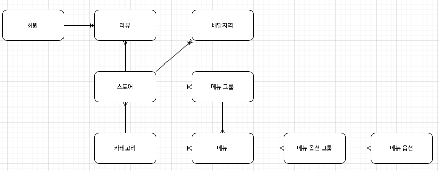

# Food-Service
- ES 스터디 후 프로젝트 구조 설계 

## 요구사항

`카테고리`
- 카테고리는 자식을 가질 수 없다. (flat 한 구조)
    - 해시태그와 같은 개념으로 사용

`메뉴`
- 메뉴는 여러 카테고리에 분류 될 수 있다.
- 메뉴는 여러 메뉴 옵션을 가질 수 있다.
- 메뉴는 그루핑 될 수 있다.

`메뉴 그룹`
- 메뉴 그룹은 여러 메뉴를 가질 수 있다.

`메뉴 옵션`
- 메뉴 옵션은 여러 메뉴에 속할 수 있다.
- 메뉴 옵션은 필수 옵션과 추가 옵션이 존재한다.
- 메뉴 옵션은 그루핑 될 수 있다.

`메뉴 옵션 그룹`
- 메뉴옵션 그룹은 여러 메뉴 옵션을 가질 수 있다.

`스토어`
- 스토어는 여러 카테고리를 가질 수 있다
- 스토어는 여러 메뉴를 판매할 수 있다
- 스토어는 여러 리뷰를 가질 수 있다
- 스토어는 배달 지역을 지정할 수 있다.
- 스토어는 여러 배달 지역을 지정할 수 있다.

`배달 지역`
- 배달 지역은 하나의 스토어에 속할 수 있다.

`회원`
- 회원은 관리자와 일반 사용자, 판매자로 구분된다
- 회원은 여러 리뷰를 작성할 수 있다
  
`리뷰`
- 리뷰는 평점이 존재한다
- 리뷰는 비속어를 입력할 수 없다

## 기능 목록
- 카테고리 관리
- 스토어 관리
- 메뉴 관리
- 회원 관리
- 리뷰 관리

## 도메인 모델 분석

    

